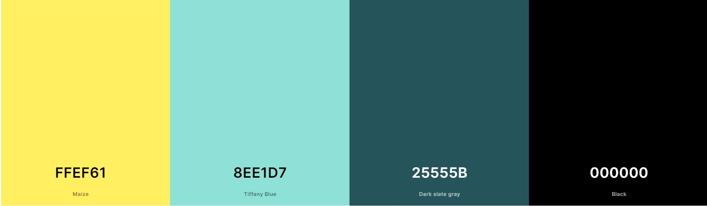
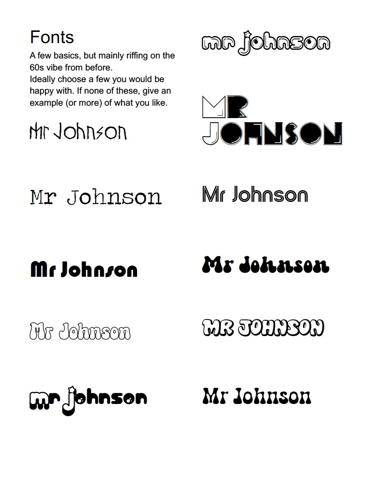
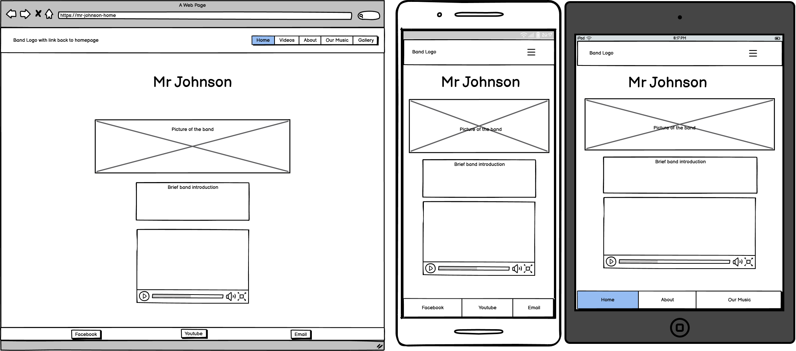
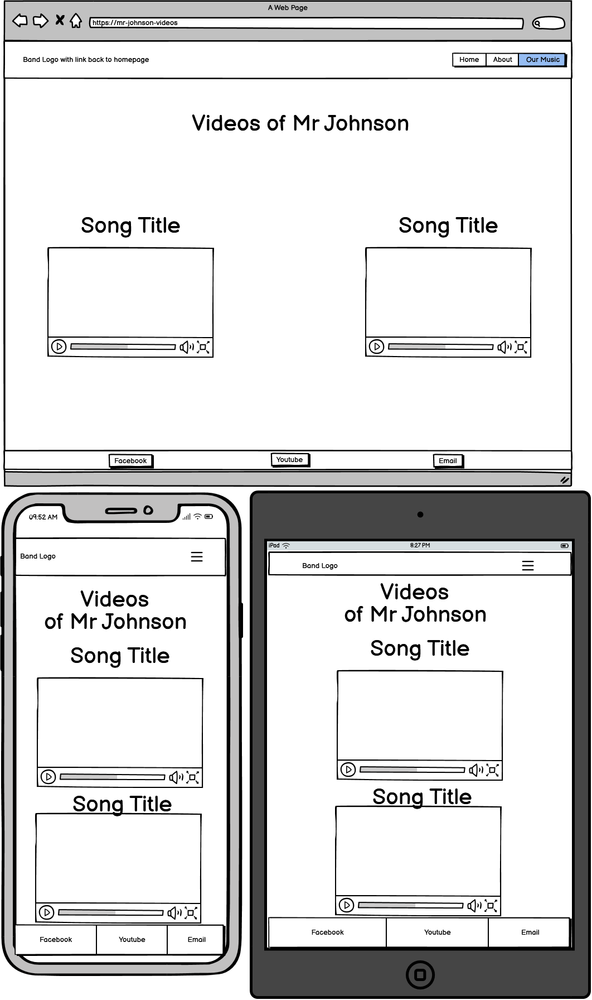
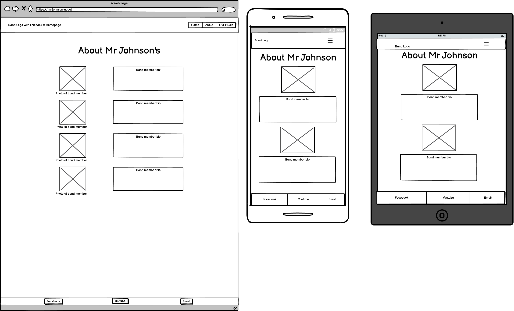
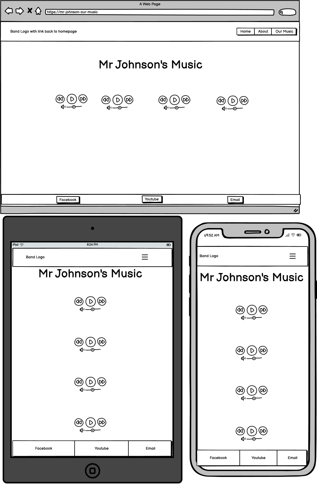
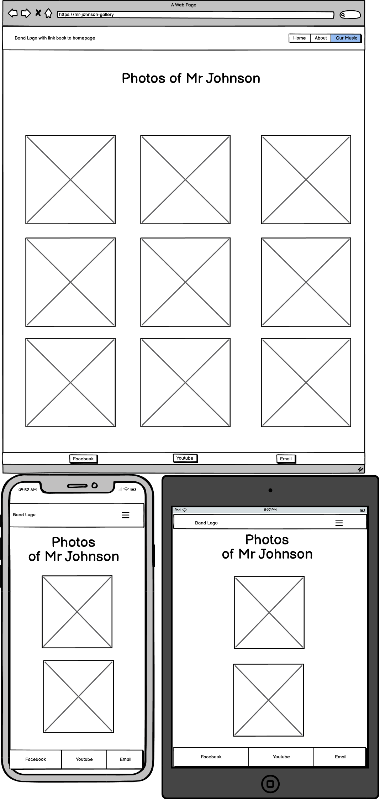

# Mr Johnson
This website was created to provide an easy way for fans of Mr Johnson to keep track of news, gigs and general info of the band.

[View the Mr Johnson Website here](https://jayscarrott.github.io/mr-johnson/)
## Contents
* [User Experience](#user-experience-ux)
  * [Initial Discussion](#initial-discussion)
  * [User Stories](#user-stories)

* [Design](#design)
  * [Colour Scheme](#colour-scheme)
  * [Typography](#typography)
  * [Imagery](#imagery)
  * [Wireframes](#wireframes)

* [Features](#features)
  * [General Features on Each Page](#general-features-on-each-page)
  * [Future Implementations](#future-implementations)
  * [Accessibility](#accessibility)

* [Technologies Used](#technologies-used)
  * [Languages Used](#languages-used)
  * [Frameworks, Libraries & Programs Used](#frameworks-libraries--programs-used)

* [Deployment & Local Development](#deployment--local-development)
  * [Deployment](#deployment)
  * [Local Development](#local-development)
    * [How to Fork](#how-to-fork)
    * [How to Clone](#how-to-clone)

* [Testing](#testing)

* [Credits](#credits)
  * [Code Used](#code-used)
  * [Content](#content)
  * [Media](#media)
  * [Acknowledgments](#acknowledgments)

## User Experience (UX)

### Initial Discussion

The band and I all had an initial meeting, where we discussed what we wanted the website to be. We covered layout, colour scheme, fonts, and overall content.
I let the band discuss their ideas and helped guide them towards realistic expectations as this would be my first website.

### User Stories

#### Target Audience

The target audience for this website, is fans for the band Mr Johnson, who want to stay update with the band and interact with media related to the band.

#### First Time Visitor Goals

* All the information fans of the band would like
* Easy navigation throughout the site
* Be able to hear what the band sounds like
* Have easy access to our social media platforms
* See upcoming Mr Johnson gigs
* Have access to a way to contact Mr Johnson

## Design

### Colour Scheme

We knew initially that we wanted the page to have a warm feel, yellows and oranges were agreed upon. Then we gravitated towards more 60s/70s styling, so reds and light blues were used to compliment and contrast with the base colours.

Once I actually began styling the website with the initial colour scheme, I tested the accessibility on Google developer tools, with Lighthouse, and found that with the current colour scheme, the text, especially the headings, were very hard to read. I used the Deque University Colour Contrast Analyzer, and it turns out that orange text is rather hard to read.

I've changed the colour scheme to mainly consist of yellow and blue, with black text. This helps with the accessibility of the site, but gives the website quite a striking presentation.

### Typography

Once we knew the overall "vibe" we were going for, we looked at a lot of different fonts. One of the band members sent the above picture with font ideas. I did say that I may not be able to use them exactly, as they are from 1001fonts and dafont, but I'll stick as close as I can, wishing to use Google fonts for my first project, to keep things relatively simple.

### Imagery

Being a website for a band, most of the imagery will be either shots of the band or some more artistic shots that relate to the band.

### Wireframes

## Features

### General features on each page

* A header that consists of a logo with a hyperlink to the Home page and a responsive navigation bar, with buttons for each page of the site.
* A footer that has links to Youtube, Facebook and an email link that all open in new pages.

### Future Implementations

* Having changed my website to a one-page website, I'd like to make it clear which page is actually active, once you've reached the anchor for that page section.
* I'd like to have a more diverese colour scheme, but my main focus was accessibility with this current iteration.
* Include more content so the website can go back to having multiple seperate HTML as opposed to one.

### Accessibility

I have tried my hardest to make the site as accessible as possible, I have done this by:

* Using semantic HTML where possible
* Having a contrasting colour scheme
* Easy to read text

## Technologies Used

### Languages Used

HTML
CSS

### Frameworks, Libraries & Programs Used

Bootstrap 5.3 - This helped me to make the page more responsive and made the layout easier to manage.

Balsamiq - Used to create wireframes

Coolers - Used for colour palette selection

Google Fonts - Used for Fonts

Replit - Initially used to write the code before moving to Visual Studio

Visual Studio Code - Used to write code for main project

Notepad - Quick place to store code when changing for comparison

CloudConvert - Converting JPG to Webp

FreeConvert - Converting JPG to Webp

www.photoresizer.com - resizing images

Deque University Colour Contrast Analyzer - Checking colour contrast for accessibility

## Deployment & Local Development

### Deployment

My website was used to deploy my website, the instructions are as follows:

1. Log into/sign-up to Github
2. Locate the repository, JayScarrott/mr-johnson, (https://github.com/JayScarrott/mr-johnson).
3. Click on the settings link, located at the top-middle of the page
4. Click on the Pages link, located on the left, in the side navigation bar.
5. In the source section, select Deploy from a Branch.
6. In the Branch section, below the source section, select the dropdown menu for select branch and selct main. 
7. Then for the folder, in the drop down menu, selec root.
8. Click Save and the website will be live.

### Local Development

#### How to Fork

1. Log in (or sign up) to Github.
2. Go to the repository for this project, JayScarrott/mr-johnson, (https://github.com/JayScarrott/mr-johnson).
3. Click the Fork button in the top right corner.

#### How to Clone

1. Log in (or sign up) to GitHub.
2. Go to the repository for this project, JayScarrott/mr-johnson, (https://github.com/JayScarrott/mr-johnson).
3. Click on the code button, select whether you would like to clone with HTTPS, SSH or GitHub CLI and copy the link shown.
4. Open the terminal in your code editor and change the current working directory to the location you want to use for the cloned directory.
5. Type 'git clone' into the terminal and then paste the link you copied in step 3. Press enter.

## Testing

Please click [Here](testing.md) to view the all the testing done for this website.

## Credits

### Code Used

I used samples of code form the bootstrap documentation, and edited it to fit my page.

### Content

I wrote the majority of the content, but the band members all wrote their own bios for the about page.

###  Media

All media used on the site is from the band.

###  Acknowledgments

Paul Bowers

Graeme Taylor

Kera Cudmore [https://github.com/kera-cudmore/readme-examples/commits?author=kera-cudmore]